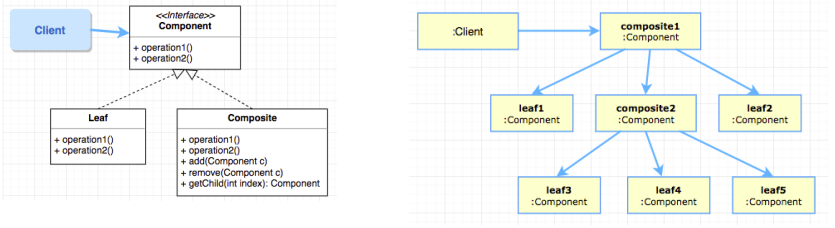

# Composite Pattern

* Allows for composition of objects into tree structures to represent part-whole hierarchies

## Problem
A composite is an object designed as a composition of one-or-more similar objects

* Ideal for problems such as design a calculator.

* Aim is to be able to manipulate a single instance of the object just as we would manipulate a group of them. For example,
    * Operation to resize a group of shapes should be same as resizing a single shape.
    * Calculating size of a file should be same as a directory.

## Solution
1. Define a **unified component interface** for both Leaf objects and composite objects.
2. A composite **stores a collection of children components** (either Leaf and/or Composite objects).
3. Clients can ignore the differences between compositions of objects and individual objects, this greatly simplifies clients of complex hierarchies and makes them easier to implement, change, test, and reuse.



* Tree structures are normally used to represent part-whole hierarchies.
* Leaf object performs operations directly on the object.
* A composite performs operation on its **children**, and if required, collects return values and derives the required answers.

```java
//code segment from the composite class

// stores a collection of children components
ArrayList<Component> children = new ArrayList<Component>();

@Override
public double calculateCost() {
    double answer = this.getCost();
    // performs operation on its children
    for (Component c : children) {
        answer += c.calculateCost();
    }
    // collects return values
    return answer;
}
```

## Implementation Issue: Uniformity vs Type Safety
Type Safety: only define child-related operations in the Composite class.
Uniformity: Include all child-related operations in the **Component** interface.