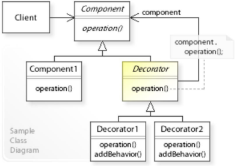

# Decorator Pattern
* Attaches additional responsibilities to an object dynamically

## Implementation

* Client: refers to the Component interface
* Component: defines a common interface for Component1 and Decorator objects.
* Decorator: maintains a reference to a Component object, and forwards requests to this component object (component.operation())
* Decorator1, Decorator2,... Implement additional functionality (addBehavior()) to be performed before and/or after forwarding a request.


```java
// common interface for component and decorator object.
public interface Component {
    void doOperationA();
    void doOperationB();
}
// component 1
public class ConcreteComponent implements Component {
    @Override
    void doOperationA();

    @Override
    void doOperationB();
}
// Decorator: reference to a component object
public abstract class Decorator implements Component {
    private ConcreteComponent cc;
}

public class ConcreteDecoratorX extends Decorator {}
```