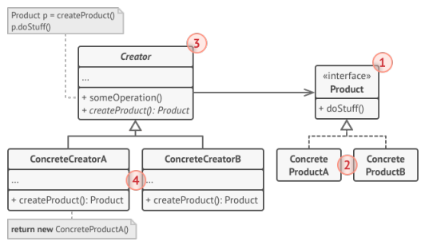
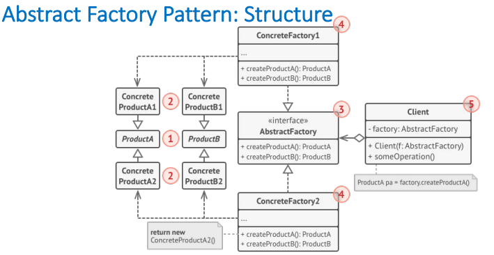

# Factory Method
* Provides an interface for creating objects in a superclass, but allows subclasses to alter the type of objects that will be created.
## Problem & Solution
* Creating an object direcly within the class that requires the object is inflexible
* Define a separate operation (factory method) for creating an object.
* Enables writing subclasses to change the way an object is created.

1. The product declares the interface, which is common to all objects that can be produced by the creator and its subclasses.
2. Concrete Products are different implementations of the product interface.
3. The creator class declares the factory method that returns new product objects.
4. Concrete Creator override the base factory method so it returns a different type of product.
## Implementation

# Abstract Factory
A creational design pattern that lets you produce **families of related objects** without specifying their concrete classes.

## Problem:
* Having family of related products (e.g. Chair + Sofa + CoffeeTable)
* Several variants of the family (e.g. Chair, Sofa, CoffeeTable has variation of: {Wooden, Plastic, etc.}).

##  Implementation

1. **Abstract Products** declare interfaces for a set of distinct but related products which make up a product family.
2. **Concrete Products** are various implementations of abstract products, grouped by Variants. Each abstract product (chair/sofa) must be implemented in all given variants (Victorian/Modern)
3. **Abstract Factory** Interface declares a set of methods for creating each of the abstract products.
4. **Concrete Factories** implements creation methods of the abstract factory. Each concrete factory corresponds to a specific variant of products and creates only those product variants.
5. The **client** can work with any concrete factory/product variant, as long as it communicates with their objects via abstract interfaces.

```java
Public interface product {}

public abstract class Creator {
    abstract public Product makeProduct();
}

public class ConcreteCreator extends Creator {
    @Override
    public Product makeProduct;
}
```