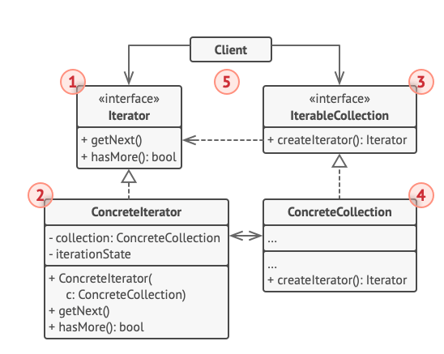

# Iterator Pattern

Allows for traversal of items in a collection without revealing any internal data structures.

## Problem
How do we traverse an aggregate entity without exposing its underlying representation?

Maintain abstraction and encapuslation.
Initial Solution - a method in the interface
* what if we want multiple ways to traverse the container?

**By separating containers, iterators, and algorithms.**
* Avoid bloating interfaces with different traversal methods.

## Implementation
* Client requests an iterator from the container
* Container needs to provide a method for creating an iterator, to show that it is iterable.



1. The **Iterator interface** declares the operations required for traversing a collection: fetching the next element, retrieving the current position, restart iteration, etc.
2. **Concrete iterators** implement specific algorithms for traversing a collection. The iterator object should track the traversal progress on its own, allowing several iterators to traverse the same collection indenpendently.
3. The **Collection interface** declares one or multiple methods for getting iterators compatible with the collection.
    * return type of the methods must be declared as the iterator interface so that concrete collections can return various kinds of iterators.

4. **Concrete Collections** return new instances of a particular concrete iterator class each time the client requests one.
5. Client works with both colelctions and iterators via their interfaces. This way the client isn't coupled to concrete classes, allowing you to use various collections and iterators with the same client code.

```java
/*
    Iterator Interface
*/
public interface iteratorI {
    public Item getNext();
    public boolean hasMore();
}
/*
    Concrete Iterator classes
*/ 
public class ListIterator1 implements iteratorI {
    // Define collection
    private ListCollection lc;
    private String itemId;
    // Define iterationState
    private currentPosition;
    private List<Item> cache = new ArrayList();

    public ListIterator() {...}
    // ...
    @Override
    public Item getNext() {...}
    @Override
    public boolean hasMore() {...}
    // ...
}
public class ListIterator2 implements iteratorI {
    // ... similar as above, just different algorithm
}
/*
    Collection Interface
*/
public interface collectionI {
    public IteratorI createIterator1();
    public IteratorI createIterator2();
}

/*
    Concrete Collection class
*/
public class ListCollection implements collectionI {
    // ...

    @Override
    public Iterator createIterator1() {...}
    @Override
    public Iterator createIterator2() {...}
}

```