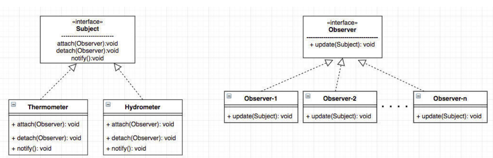
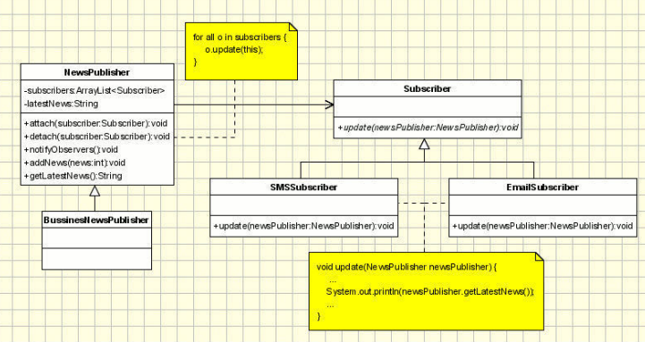

# Observer Pattern

* a One-to-Many dependency between objects so that when one object (subject) changes state, all of its dependents (observers) are notified and updated automatically.
* An object, called the subject, maintains a list of its dependents, called observers, and notifies them automatically of any state changes, usually by calling one of their methods

## Problem

Whenever there is an scenario where the one object's (observer's) state are constantly dependent on another object's (subject's) action.
* e.g. youtuber-to-subscriber relationship, youtube being the subject, subscriber being the observer

## Implementation



```java
public interface Observer {
  void update();
}

public class Observable {
  private ArrayList<Observer> observers;
  void addObserver(Observer o);
  void removeObserver(Observer o);
  void notifyObservers():
}

public class Display implements Observer {
  @Override
  void update();
}
```

### Passing Data: Push and Pull
The subject has two options to change data while notifying subscribers.

1. Push Data
* Subject passes the changed data to its observers, for example:
```java
update(data1, data2, ...)
```
* All observers must implement the above update method.
2. Pull data
* Subject passes reference to itself to its observers
* Observer need to pull the required data from the subject.
```java
update(this)
```
* subject needs to provide the required access methods for its observers. e.g.
```java
public double getVariable();
```

