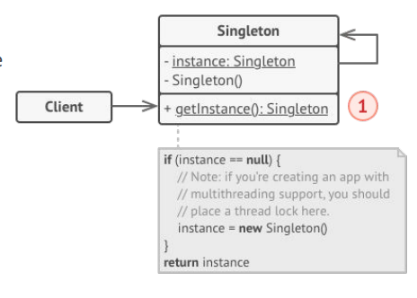

# Singleton Pattern

Singleton pattern ensures a class only has **one instance throughout the lifetime of the program.**

Providing a global access point to this instance.

## Problem
A client wants to ensure that a class **has just a single instance**, and provde a global access point to that instance.

## Implementation
two steps in common for singleton implementations.

1. make default constructor **private**, to prevent other objects from using the new operator with the Singleton class.
2. Create **static creation method** that acts as a constructor. Under the hood, this method calls private constructor to **create an object and saves it in a static field.** All following calls to this method return the cached object.
* Whenever singleton's static method is called, the same object is always returned.


* Singleton class declares the static method `getInstance()` that returns the same instance of its own class.
* the **ONLY** way of getting Singleton object is to call `getInstance()`

```java
public class Singleton {
    private static final Singleton instance = new Singleton();
    
    // private constructor
    private Singleton() {...}

    //static creation method.
    public static synchronized Singleton getInstance() {
        //Place a thread lock here if you are creating an app with multithreading support.
        if (instance == null) {
            instance = new Singleton();
        }
        return instance;
    }
}
```