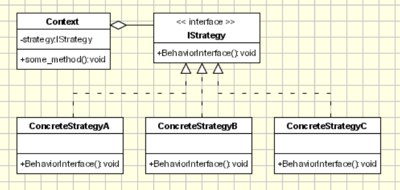

# Strategy Pattern
## Problem and situation
* Allows you to encapsulate a family of algorithms.
* Enables you to "change behaviour" at RUN TIME

Strategy pattern are commonly implemented when the problem involves in many condition statements.
**When the problem contains a lot of if/else-if statements**

## Implementation



1. Context / Client able to access Strategy through strategy interface.
2. variable initially in standard algorithm/strategy. Client can use methods of the strategy.
```java
...
private ChargingStrategy chargingStrategy = new StandardStrategy();
...
```
3. client can set to different stratey through a method.
```java
...
public void setChargingStrategy(ChargingStrategy chargingStrategy) {
    this.chargingStrategy = chargingStrategy;
}
...
```
Implementation would look like:
```java
public static void main(String[] args) {
    Restaurant r = new Restaurant("XS");
    r.displayMenu();
    r.setChargingStrategy(new HappyHourStrategy());
    r.displayMenu();
    r.setChargingStrategy(new HolidayStrategy());
    r.displayMenu();
}
```