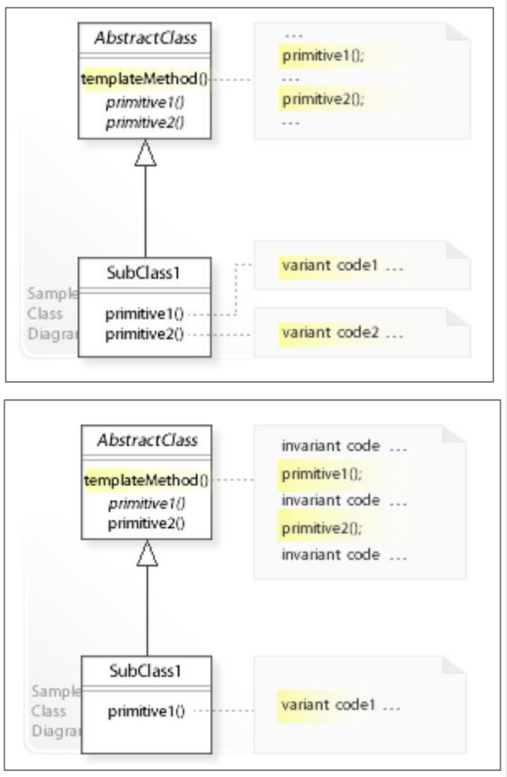
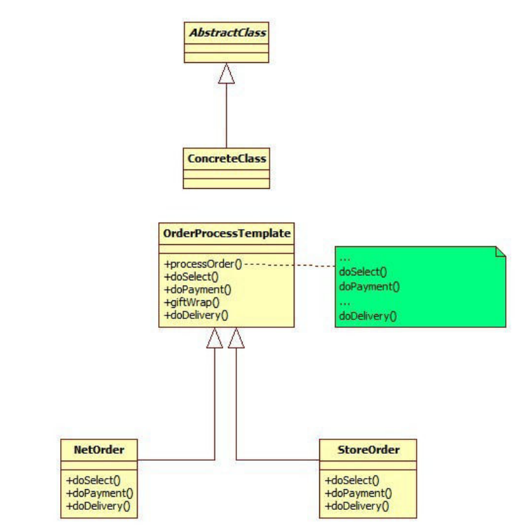

# Template Pattern

* Define the skeleton of an algorithm in an operation, deferring some steps to subclasses.
Template Method lets subclasses redefine certain steps of an algorithm without changing the algorithm's structure.

## Problem
* Subclasses do not control the behavior of a parent class, a parent class calls the operations of a subclass and not the other way around.

* **Inversion of Control**:
    * When using a library, we call the code we want to reuse.
    * when using a framework, we writes subclasses and implement the variant code the framework calls.

## Implementation
* Abstract class defines a `templateMethod()` to implement an invariant structure (behaviour)
* `templateMethod()` calls methods defined in the abstract class (abstract or concrete) - like primitive1, primitive2, etc.
* Default behaviour can be implemented in the abstract class by offering concrete methods.
* subclasses can implement primitive methods for variant behaviour.





```java
public abstract class ObjectTemplate {
    public void operation1() {...}
    public void operation2() {...}
}
public class Object extends ObjectTemplate {
    // if not included in this class, operation1 is not overriden and operate base on ObjectTemplate.
    @Override
    public void operation2() {...}
}
```